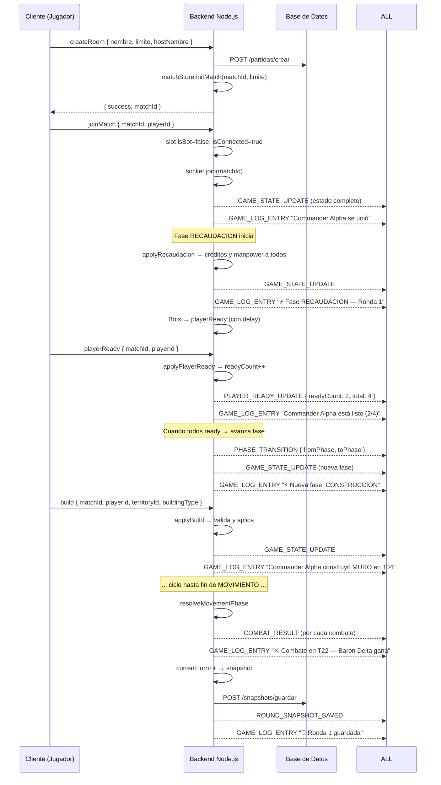

# Plan de Implementación — Motor de Juego en el Backend

## Descripción

Implementar el motor de juego en el **backend Node.js/Socket.io** de forma que:

- **Cada partida tenga su propio estado aislado** en memoria (territorio, jugadores, ejércitos), identificado por `matchId`.
- **Toda acción de un jugador** genere una entrada en el **Game Log** que se emite a **todos** los jugadores de esa partida.
- El ciclo de fases (RECAUDACION → CONSTRUCCION → RECLUTAMIENTO → MOVIMIENTO) sea gestionado enteramente por el backend.
- Los bots actúen automáticamente en nombre de los slots vacíos.
- Se guarde un snapshot en BD al final de cada ronda completa.

---

## Arquitectura de la Memoria del Servidor

Cada partida vive en un `Map<matchId, GameState>` en memoria. Al crear una partida se inicializa su `GameState` con el territorio fijo (41 hexágonos), los 4 jugadores (todos bots), los 4 ejércitos iniciales y la fase RECAUDACION.

```
matchStates: Map<matchId, GameState>

GameState {
  matchId, currentPhase, currentTurn,
  players[],        // { id, name, faction, color, credits, manpower, isReady, isBot, isConnected, socketId }
  territories[],    // { id, ownerId, buildingType, occupiedByArmyId, adjacentIds, isRefinery, isHQ, ... }
  armies[],         // { id, ownerId, territoryId, troopSize, hasActedThisTurn }
  pendingMoves[],   // { armyId, fromTerritoryId, toTerritoryId }
  log[]             // historial en memoria de esta sesión
}
```

---

## Flujo del Game Log

**Regla fundamental**: Después de cualquier evento que modifique el estado del juego, el backend emite dos cosas a la sala (`io.to(matchId)`):
1. `GAME_STATE_UPDATE` — estado completo actualizado
2. `GAME_LOG_ENTRY` — entrada de log describiendo la acción

```
GAME_LOG_ENTRY  (broadcast a todos los jugadores de la partida)
  payload: {
    matchId,
    timestamp,         // ISO string
    type,              // 'action' | 'phase' | 'combat' | 'system'
    actorName,         // nombre del jugador o "Sistema"
    message            // texto descriptivo de la acción
  }
```

Ejemplos de mensajes de log:
| Evento | Mensaje |
|--------|---------|
| BUILD | `"Baron Delta construyó TORRE en territorio T05"` |
| RECRUIT | `"Commander Alpha reclutó 5 tropas"` |
| QUEUE_MOVE | `"Scout Sigma mueve ejército hacia T22"` |
| PLAYER_READY | `"Chief Omega está listo (2/4)"` |
| PHASE_TRANSITION | `"⚡ Nueva fase: RECLUTAMIENTO"` |
| COMBAT_RESULT | `"⚔️ Baron Delta conquista T15 (15 tropas supervivientes)"` |
| ROUND_SNAPSHOT | `"💾 Ronda 3 guardada"` |

---

## Archivos a Crear / Modificar

### Backend — Motor de Juego

---

#### [NEW] `src/game/mapDefinition.js`
Definición estática del mapa: 41 territorios con sus coordenadas hex, propietarios iniciales, adyacencias, `isRefinery`, `isHQ`, `hasSupremeBase`.

#### [NEW] `src/game/gameFactory.js`
Función `createInitialGameState(matchId, jugadores_limite)`:
- Clona el mapa estático.
- Crea los 4 slots de jugador con sus valores iniciales (500 cr, 200 mp, isBot=true).
- Crea los 4 ejércitos iniciales en los HQ correspondientes.
- Retorna el `GameState` completo listo para meter en `matchStates`.

#### [NEW] `src/game/gameEngine.js`
**El núcleo del motor**. Exporta funciones puras que reciben el `GameState` y retornan el estado modificado + lista de logs generados:

```
applyRecaudacion(state)       → { state, logs[] }
applyBuild(state, playerId, territoryId, buildingType)    → { state, logs[], error? }
applyDestroyBuilding(state, playerId, territoryId)        → { state, logs[], error? }
applyRecruit(state, playerId, territoryId, troopSize)     → { state, logs[], error? }
applyQueueMove(state, playerId, armyId, toTerritoryId)   → { state, logs[], error? }
applyCancelMove(state, playerId, armyId)                  → { state, logs[], error? }
applyRetreat(state, playerId, armyId)                     → { state, logs[], error? }
applyPlayerReady(state, playerId)                         → { state, logs[], phaseAdvanced: bool }
resolveMovementPhase(state)  → { state, combatResults[], logs[] }
```

Contiene también `checkAllReady(state)` y `advancePhase(state)` que orquesta la transición de fase.

#### [NEW] `src/game/botAI.js`
Lógica de bot por fase. Se invoca automáticamente cuando la fase inicia y hay jugadores con `isBot=true`. Usa `gameEngine.js` internamente con un retardo de 1-3 s.

#### [NEW] `src/game/matchStore.js`
Singleton que gestiona el `Map<matchId, GameState>`:
```js
initMatch(matchId, limite)    // crea y registra el GameState
getMatch(matchId)             // retorna el GameState o null
removeMatch(matchId)          // elimina la partida de memoria
saveSnapshot(matchId)         // serializa y persiste en BD via apiClient
loadSnapshot(matchId)         // recupera snapshot de BD y reconstruye estado
```

#### [MODIFY] `src/handlers/partidas.js`
Añadir los nuevos eventos de juego:

| Evento Socket (cliente→backend) | Acción |
|----------------------------------|--------|
| `joinMatch` | Asignar slot bot→humano, emitir `GAME_STATE_UPDATE` completo |
| `leaveMatch` | Slot humano→bot |
| `playerReady` | `applyPlayerReady`, si todos listos → avanzar fase |
| `build` | `applyBuild` → broadcast |
| `destroyBuilding` | `applyDestroyBuilding` → broadcast |
| `recruit` | `applyRecruit` → broadcast |
| `queueMove` | `applyQueueMove` → broadcast |
| `cancelMove` | `applyCancelMove` → broadcast |
| `retreat` | `applyRetreat` → broadcast |

Después de **cada acción exitosa**, el handler emite:
```js
// 1. Estado actualizado
io.to(matchId).emit('GAME_STATE_UPDATE', state);
// 2. Log de la acción
io.to(matchId).emit('GAME_LOG_ENTRY', logEntry);
```

También, al crear una partida (`createRoom`), se llama a `matchStore.initMatch(matchId, limite)`.

#### [MODIFY] `src/schemas/index.js`
Añadir schemas Zod para todos los nuevos payloads:
- `joinMatchPayload` — `{ matchId, playerId }`
- `playerReadyPayload` — `{ matchId, playerId }`
- `buildPayload` — `{ matchId, playerId, territoryId, buildingType }`
- `destroyBuildingPayload` — `{ matchId, playerId, territoryId }`
- `recruitPayload` — `{ matchId, playerId, territoryId, troopSize }`
- `queueMovePayload` — `{ matchId, playerId, armyId, toTerritoryId }`
- `cancelMovePayload` — `{ matchId, playerId, armyId }`
- `retreatPayload` — `{ matchId, playerId, armyId }`

---

### Frontend Angular — Game Log

---

#### [MODIFY] `hud.component.ts`
- Sustituir `mockLogs[]` por un array real `gameLogs[]` alimentado por el evento `GAME_LOG_ENTRY` del socket.
- El `SocketService` escucha `GAME_LOG_ENTRY` y añade la entrada al store/array.
- El log se auto-scrollea al fondo al recibir nuevas entradas.

#### [MODIFY] `hud.html`
- El `*ngFor` del log itera sobre `gameLogs$` (observable del store) en lugar de `mockLogs`.
- Añadir clase CSS según `type` del log (`action`, `phase`, `combat`, `system`) para colores distintos.

---

### Base de Datos — Snapshots

La tabla `partidas` ya existe. Hay que añadir una tabla de snapshots (se puede hacer en el `.sql` o directamente en el backend con la API de Spring Boot si ya existe un endpoint de snapshot).

> [!IMPORTANT]
> **Decisión pendiente**: ¿El snapshot se guarda directamente en MariaDB a través del Spring Boot REST API o directamente desde el backend Node.js con una conexión mysql2? Actualmente `apiClient` solo delega al Spring Boot. Si Spring Boot no tiene endpoint de snapshot, habría que crearlo, o bien conectar Node.js directamente a la BD.

---

## Flujo Completo de una Partida (resumen)



---

## Plan de Verificación

### Backend
- Arrancar el backend y conectar dos clientes con `wscat` o Postman WS.
- Crear una sala → verificar que `matchStates` tiene el `matchId`.
- Hacer `joinMatch` → verificar `GAME_STATE_UPDATE` con el estado inicial completo.
- Hacer `build` → verificar que llega `GAME_STATE_UPDATE` + `GAME_LOG_ENTRY` a ambos clientes.
- Hacer `playerReady` con ambos clientes → verificar avance de fase.
- Verificar que los bots actúan automáticamente con delay y la partida avanza sola.

### Frontend
- Abrir el Intel Feed (Game Log) y verificar que los mensajes llegan en tiempo real.
- Verificar que los mensajes tienen el color correcto según el tipo (`action`, `phase`, `combat`).
- Verificar auto-scroll al fondo al recibir nuevas entradas.

---

## Orden de Implementación

1. `mapDefinition.js` — datos estáticos del mapa
2. `gameFactory.js` — creación del estado inicial
3. `gameEngine.js` — lógica pura por fase
4. `matchStore.js` — gestión del Map en memoria
5. `botAI.js` — comportamiento de bots
6. `schemas/index.js` — nuevos schemas Zod
7. `handlers/partidas.js` — nuevos eventos Socket
8. Frontend HUD — conectar log real
