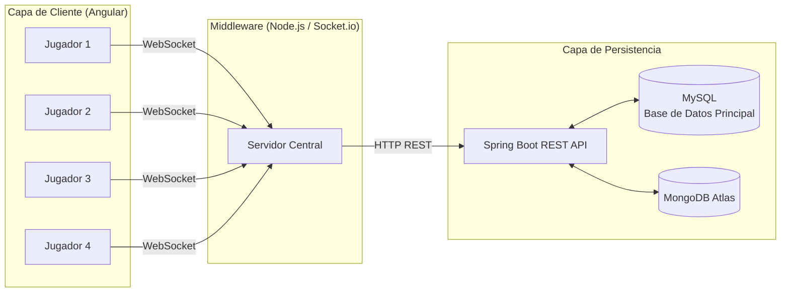
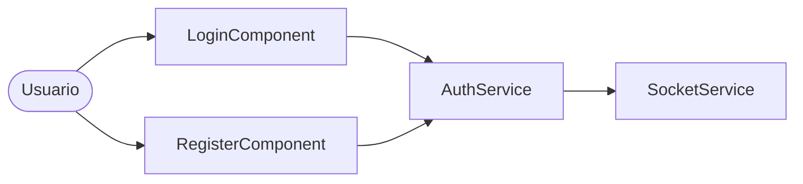
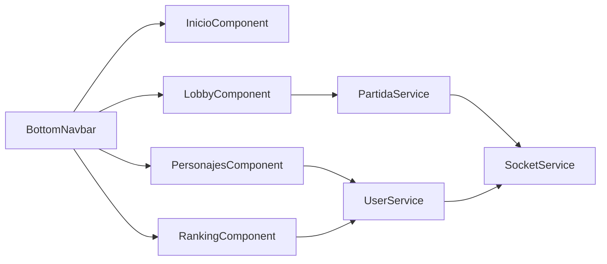
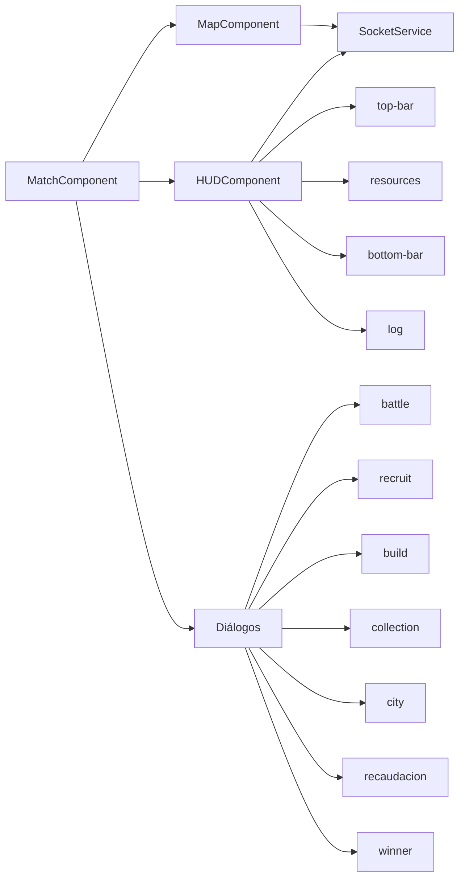
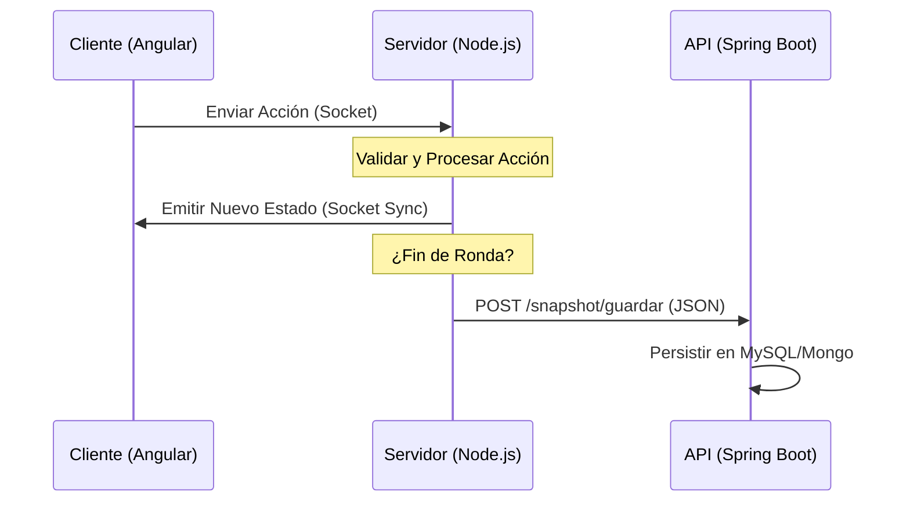
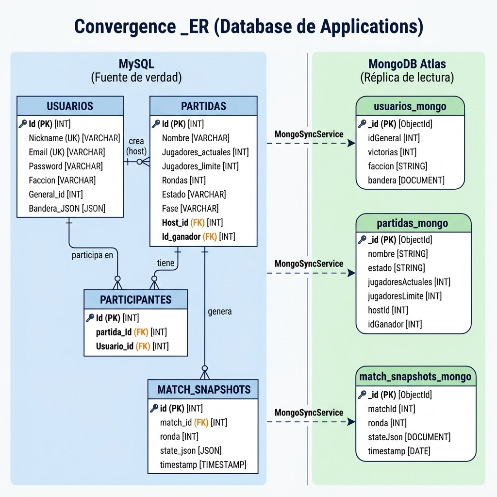

# 1. Definición y Temática del Proyecto

## 1.1 Descripción de la Temática

Nuestro juego, Convergence, es un juego de estrategia militar por turnos multijugador ambientado en un universo de conflicto militar moderno. Dos a cuatro jugadores, cada uno al mando de su propia facción con nombre e identidad visual personalizada (bandera y colores propios), compiten por el control de un mapa hexagonal de 7×7 territorios.

El objetivo de la partida es la **dominación territorial suprema**: el primer jugador que conquiste y mantenga bajo su control todas las **Bases Supremas** del mapa se proclama ganador. Cada facción comienza en una esquina del tablero con su Base Suprema y un pequeño ejército, y debe expandirse progresivamente hacia el centro y las posiciones rivales.

---

## 1.2 Mecánicas Principales

La partida se desarrolla en **rondas**, y cada ronda se divide en cuatro fases que todos los jugadores deben completar de forma simultánea antes de avanzar:

| Fase                    | Descripción                                                                                                                                                                                              |
| ----------------------- | --------------------------------------------------------------------------------------------------------------------------------------------------------------------------------------------------------- |
| **Recaudación**  | El servidor calcula automáticamente los ingresos de cada jugador en función de los territorios controlados, las refinerías ocupadas y los edificios construidos. Se aplican bonificaciones de general. |
| **Construcción** | Cada jugador puede construir o demoler una estructura en cualquier territorio que posea.                                                                                                                  |
| **Reclutamiento** | El jugador puede contratar nuevas unidades en su Base Suprema                                                                                                                                             |
| **Movimiento**    | Cada ejército puede ordenar un desplazamiento. Al finalizar la fase, el servidor resuelve todos los movimientos siguiendo el orden en el que se ordenaron, detectando y calculando combates.             |

**Recursos del juego:**

| Recurso             | Uso                                                                   |
| ------------------- | --------------------------------------------------------------------- |
| **Créditos** | Moneda principal. Se usan para construir edificios y reclutar tropas. |
| **Manpower**  | Recurso secundario. Necesario para reclutar unidades.                 |

**Edificios disponibles:**

| Edificio           | Coste         | Efecto                                                      |
| ------------------ | ------------- | ----------------------------------------------------------- |
| **Cuartel**  | 200 créditos | Permite reclutar tropas. Genera +20 mano de obra por ronda. |
| **Fábrica** | 300 créditos | Genera +50 créditos por ronda.                             |
| **Torre**    | 150 créditos | Otorga +15 de defensa al territorio.                        |
| **Muro**     | 100 créditos | Otorga +10 de defensa al territorio.                        |

**Resolución de combate:**
Cuando dos ejércitos rivales se encuentran en el mismo territorio al resolverse la fase de Movimiento, el servidor calcula las bajas de ambos bandos aplicando las bonificaciones defensivas de edificios y generales y usando un sistema de aleatorizacion. El ejército que pierda todas sus tropas es eliminado; si el atacante vence, conquista el territorio.

---

## 1.3 Generales — Personajes y Habilidades

Antes de entrar a una partida, cada jugador elige un **General** que le otorga una ventaja pasiva única durante toda la partida. La elección del general es permanente por cuenta y se guarda en la base de datos.

| ID | General                                     | Rango      | Especialidad       | Bonus en Partida                                    |
| -- | ------------------------------------------- | ---------- | ------------------ | --------------------------------------------------- |
| 1  | **Viktor Drakov** — *Iron Wolf*    | Coronel    | Ataque Relámpago  | +1 casilla de alcance de movimiento para sus tropas |
| 2  | **Elena Vostok** — *Shadow Hawk*   | Comandante | Defensa Férrea    | +10 de defensa en todos los territorios propios     |
| 3  | **Marcus Steele** — *Thunder Fist* | General    | Artillería Pesada | +10 de daño al atacar territorios enemigos         |
| 4  | **Aria Nomura** — *Viper Queen*    | Capitana   | Guerra Económica  | +5% de ingresos de créditos y manpower cada ronda |

---

# 3. Arquitectura del Sistema

# 3.1 Visión General del Sistema

La aplicación se compone de tres capas principales que interactúan entre sí para ofrecer una experiencia de juego fluida y persistente. Toda la comunicación del frontend pasa siempre por el Middleware; en ningún momento el cliente contacta directamente con la API REST de Spring Boot.



---

## 3.2 Clientes Multiplataforma

El frontend está desarrollado en **Angular**, estructurado en cuatro grandes bloques funcionales. Todos los bloques se comunican con el backend exclusivamente a través del `SocketService`, que actúa como única puerta de entrada hacia el Middleware.

---

### 3.2.1 Autenticación — `login` / `register`

Punto de entrada de la aplicación. El usuario introduce sus credenciales y el `AuthService` delega la operación al `SocketService`, que emite el evento correspondiente al Middleware.



---

### 3.2.2 Área Principal — `inicio` · `lobby` · `personajes` · `ranking`

Pantallas accesibles tras el login. Gestionan la navegación entre las funcionalidades principales de la plataforma: explorar partidas, configurar el perfil y consultar el ranking global.



---

### 3.2.3 Partida — Mapa · HUD · Diálogos

Núcleo de la experiencia de juego. Se compone de tres capas superpuestas que juntas forman la interfaz de una partida activa.

**HUD (Heads-Up Display):** Paneles informativos siempre visibles durante la partida.

| Subcomponente  | Descripción                             |
| -------------- | ---------------------------------------- |
| `top-bar`    | Indicadores de turno y fase actual       |
| `resources`  | Recursos del jugador (oro, tropas, etc.) |
| `bottom-bar` | Acciones rápidas disponibles            |
| `log`        | Registro cronológico de acciones        |

**Diálogos de Acción:** Ventanas modales que se activan al interactuar con el mapa.

| Diálogo        | Acción que representa                     |
| --------------- | ------------------------------------------ |
| `battle`      | Resolución de combate entre ejércitos    |
| `recruit`     | Reclutamiento de unidades en un territorio |
| `build`       | Construcción de estructuras               |
| `collection`  | Recolección de recursos                   |
| `city`        | Gestión de ciudad                         |
| `recaudacion` | Cobro de impuestos / tributos              |
| `winner`      | Pantalla de victoria/derrota               |



---

### 3.2.4 Servicios de Comunicación

Capa transversal que abstrae toda la comunicación con el backend. Los componentes nunca llaman al servidor directamente; siempre delegan en uno de estos servicios.

| Servicio           | Responsabilidad                                                                                          |
| ------------------ | -------------------------------------------------------------------------------------------------------- |
| `SocketService`  | Gestiona las dos conexiones Socket.io (auth y juego). Expone `emit`, `listen` y `emitWithCallback` |
| `AuthService`    | Login, registro y gestión del token en `localStorage`                                                 |
| `PartidaService` | Crear, buscar, unirse y eliminar partidas                                                                |
| `UserService`    | Bandera, general y datos del ranking                                                                     |

---

## 3.3 Servidor Central (PSP) — Lógica y Tiempo Real

El servidor de **Node.js** es el motor central del juego. Su función principal es validar las acciones de los jugadores y mantener a todos los clientes sincronizados.

### 3.3.1 Sincronización mediante Sockets

Utiliza **Socket.io** para gestionar la comunicación. Cuando un jugador realiza una acción (mover tropas, atacar, recolectar), el servidor:

1. Recibe el evento del cliente.
2. Valida la acción contra el estado actual en memoria.
3. Calcula el nuevo estado.
4. Emite el estado actualizado a **todos** los jugadores en la misma sala (`io.to(matchId).emit('updateState', newState)`).

### 3.3.2 Lógica de Juego y Resolución de Acciones

La lógica reside en el `gameEngine.js`. Las acciones se resuelven de forma secuencial:

* **Validación:** Se comprueba si el jugador tiene recursos suficientes o si el movimiento es legal.
* **Cálculo:** Se ejecutan las fórmulas de combate o recolección.
* **Estado de Victoria:** Tras cada acción significativa, el motor verifica si un jugador controla todas las "Bases Supremas" para declarar un ganador.

### 3.3.3 Gestión de Estado y Snapshots

Para garantizar que una partida pueda recuperarse tras un fallo o cierre del servidor, se implementa un sistema de snapshots:

* **Estado en Memoria (`matchStore`):** El servidor mantiene un `Map` con el estado activo de todas las partidas en curso para una respuesta inmediata.
* **Guardado de Snapshots:** Al final de cada ronda o acción crítica, el servidor Node.js envía el estado completo en JSON al API de Spring Boot (`/snapshots/guardar`).
* **Carga de Snapshots:** Al iniciar o reiniciar una partida, el servidor solicita el último snapshot al API REST para reconstruir el estado en memoria.



---

## 3.4 Protocolo de Comunicación

La comunicación entre capas se estandariza mediante el uso de **JSON**.

1. **Protocolo REST (HTTP):** Utilizado para operaciones que requieren confirmación estricta y no son críticas en tiempo real (Autenticación, consulta de Ranking, creación de salas).
2. **Protocolo Real-Time (WebSockets):** Utilizado para el flujo de la partida.
   * **Payload típico:**
     ```json
     {
       "matchId": 101,
       "action": "MOVE_TROOPS",
       "payload": { "from": "hex1", "to": "hex2", "amount": 50 }
     }
     ```

---

# 4. Diseño de Base de Datos y Persistencia

## 4.1 Arquitectura de Persistencia

Nuestro proyecto emplea una estrategia de persistencia **dual**, combinando dos sistemas de bases de datos con roles claramente diferenciados:

| Sistema                  | Tecnología     | Rol principal                                        |
| ------------------------ | --------------- | ---------------------------------------------------- |
| Base de datos principal  | MySQL (MariaDB) | Base de datos — autenticación, partidas y usuarios |
| Base de datos documental | MongoDB Atlas   | Consultas de ranking                                 |

Ambas bases de datos se mantienen sincronizadas a través del servicio `MongoSyncService`, que replica los datos relevantes de MySQL a MongoDB de forma asíncrona. Este diseño permite que el motor relacional gestione la integridad referencial mientras MongoDB se utiliza para lecturas rápidas y agregaciones orientadas al juego.

---

## 4.2 Base de Datos Principal — MySQL

La base de datos MySQL es la base de datos principal de la aplicación. Contiene cuatro tablas gestionadas por Spring Boot mediante JPA/Hibernate.

### 4.2.1 Tabla `usuarios`

Almacena los datos de registro y perfil de cada jugador.

| Campo          | Tipo                     | Descripción                                         |
| -------------- | ------------------------ | ---------------------------------------------------- |
| `Id`         | INT (PK, AUTO_INCREMENT) | Identificador único del usuario                     |
| `Nickname`   | VARCHAR(100) UNIQUE      | Nombre de usuario visible en el juego                |
| `Email`      | VARCHAR(100) UNIQUE      | Correo electrónico para registro                    |
| `Password`   | VARCHAR(100)             | Contraseña cifrada con BCrypt                       |
| `Faccion`    | VARCHAR(100)             | Nombre de la facción personalizada del jugador      |
| `General_id` | INT                      | ID del general seleccionado por el jugador           |
| `Bandera`    | LONGTEXT (JSON)          | Diseño de bandera personalizada serializado en JSON |

**Endpoints relacionados:**

- `POST /auth/register` — Registra un nuevo usuario y lo sincroniza con MongoDB.
- `POST /auth/login` — Valida credenciales y sincroniza el perfil con MongoDB.
- `PUT /bandera/guardar` — Persiste el diseño de bandera y el nombre de facción del usuario.
- `GET /bandera/{nickname}` — Recupera el diseño de bandera de un usuario.
- `PUT /general/guardar` — Guarda el general seleccionado por el usuario.
- `GET /general/{nickname}` — Devuelve el general y facción actuales del usuario.

---

### 4.2.2 Tabla `partidas`

Representa cada sala de juego creada en la plataforma.

| Campo                  | Tipo                       | Descripción                                    |
| ---------------------- | -------------------------- | ----------------------------------------------- |
| `Id`                 | INT (PK, AUTO_INCREMENT)   | Identificador único de la partida              |
| `Nombre`             | VARCHAR(100)               | Nombre único de la sala                        |
| `Jugadores_actuales` | INT                        | Número de jugadores actualmente en la sala     |
| `Jugadores_limite`   | INT                        | Capacidad máxima de la sala (mínimo 2)        |
| `Rondas`             | INT                        | Contador de rondas jugadas                      |
| `Estado`             | VARCHAR(100)               | Estado actual:`"En curso"` o `"Finalizada"` |
| `Fase`               | INT                        | Fase actual del juego                           |
| `Host_id`            | INT (FK →`usuarios.Id`) | ID del usuario que creó la sala                |
| `Id_ganador`         | INT (FK →`usuarios.Id`) | ID del usuario ganador (nullable)               |

**Endpoints relacionados:**

- `POST /partidas/crear` — Crea una nueva sala; el host se añade automáticamente como participante. Valida que el usuario no supere el límite de 3 partidas activas simultáneas.
- `POST /partidas/{id}/unirse` — Permite a un usuario unirse a una sala existente.
- `GET /partidas/usuario/{nickname}` — Devuelve todas las partidas en las que participa un usuario.
- `GET /partidas/{id}` — Obtiene los detalles de una partida por ID.
- `GET /partidas/nombre/{nombre}` — Busca una partida por su nombre.
- `GET /partidas/buscar/activas` — Lista todas las salas con estado `"En curso"`.
- `DELETE /partidas/{id}` — Elimina una sala; solo puede hacerlo el host.

---

### 4.2.3 Tabla `participantes`

Tabla de relación N:M entre `usuarios` y `partidas`. Registra qué usuarios forman parte de cada sala.

| Campo          | Tipo                       | Descripción                |
| -------------- | -------------------------- | --------------------------- |
| `Id`         | INT (PK, AUTO_INCREMENT)   | Identificador del registro  |
| `partida_Id` | INT (FK →`partidas.Id`) | ID de la partida asociada   |
| `Usuario_id` | INT (FK →`usuarios.Id`) | ID del usuario participante |

---

### 4.2.4 Tabla `match_snapshots`

Almacena el estado serializado de cada partida en formato JSON, ronda a ronda. Actúa como sistema de persistencia del estado de juego para recuperación y auditoría.

| Campo          | Tipo                          | Descripción                                   |
| -------------- | ----------------------------- | ---------------------------------------------- |
| `id`         | BIGINT (PK, AUTO_INCREMENT)   | Identificador del snapshot                     |
| `match_id`   | BIGINT (FK →`partidas.Id`) | ID de la partida a la que pertenece            |
| `ronda`      | INT                           | Número de ronda capturada                     |
| `state_json` | LONGTEXT                      | Estado completo del juego en JSON              |
| `timestamp`  | DATETIME                      | Fecha y hora de creación (por defecto: NOW()) |

**Índice compuesto:** `idx_match_ronda (match_id, ronda)` para búsquedas eficientes.

**Endpoints relacionados:**

- `POST /snapshots/guardar` — Guarda o actualiza el snapshot de una ronda. Si se incluye un ganador, actualiza el estado de la partida a `"Finalizada"`.
- `GET /snapshots/match/{matchId}/ronda/{ronda}` — Recupera el snapshot de una ronda concreta.
- `GET /snapshots/match/{matchId}/latest` — Recupera el snapshot más reciente de una partida.

---

## 4.3 Base de Datos Documental — MongoDB Atlas

La base de datos MongoDB alojada en **MongoDB Atlas** actúa como capa de lectura optimizada. No es la fuente de verdad, sino una réplica desnormalizada de los datos de MySQL, diseñada para servir consultas de alta velocidad sin joins relacionales.

La sincronización se realiza de forma transparente a través del servicio `MongoSyncService`, que es invocado automáticamente en los flujos de registro, login y creación/finalización de partidas.

### 4.3.1 Colección `usuarios_mongo`

Documento de perfil extendido de cada jugador, optimizado para el ranking global.

| Campo         | Tipo    | Descripción                          |
| ------------- | ------- | ------------------------------------- |
| `_id`       | String  | Nickname del usuario (clave natural)  |
| `idGeneral` | Integer | ID del general seleccionado           |
| `victorias` | Integer | Número de victorias acumuladas       |
| `faccion`   | String  | Nombre de la facción del jugador     |
| `bandera`   | Object  | Diseño de bandera (layout y colores) |

**Endpoints relacionados (lectura desde MongoDB):**

- `GET /ranking` — Devuelve todos los usuarios ordenados por victorias descendentes.
- `GET /ranking/general/{id}` — Suma total de victorias de todos los usuarios que usan un general concreto.
- `GET /ranking/user/{nickname}` — Devuelve el perfil completo de un usuario desde MongoDB.

---

### 4.3.2 Colección `partidas_mongo`

Réplica de la tabla `partidas` en formato documento.

| Campo                 | Tipo          | Descripción              |
| --------------------- | ------------- | ------------------------- |
| `_id`               | String / Long | ID de la partida          |
| `nombre`            | String        | Nombre de la sala         |
| `estado`            | String        | Estado de la partida      |
| `jugadoresActuales` | Integer       | Jugadores en la sala      |
| `jugadoresLimite`   | Integer       | Capacidad máxima         |
| `hostId`            | Long          | ID del host               |
| `idGanador`         | Long          | ID del ganador (nullable) |

---

### 4.3.3 Colección `match_snapshots_mongo`

Réplica de los snapshots de partida para consultas analíticas.

| Campo         | Tipo     | Descripción               |
| ------------- | -------- | -------------------------- |
| `_id`       | Long     | ID del snapshot            |
| `matchId`   | Long     | ID de la partida           |
| `ronda`     | Integer  | Ronda capturada            |
| `stateJson` | String   | Estado serializado en JSON |
| `timestamp` | DateTime | Marca de tiempo            |

---

## 4.4 Sincronización SQL → MongoDB

El endpoint `/sync` permite disparar manualmente el proceso de sincronización masiva entre ambas bases de datos:

| Endpoint                | Descripción                                       |
| ----------------------- | -------------------------------------------------- |
| `GET /sync/all`       | Sincroniza usuarios, partidas y snapshots de golpe |
| `GET /sync/usuarios`  | Sincroniza únicamente la tabla de usuarios        |
| `GET /sync/partidas`  | Sincroniza únicamente la tabla de partidas        |
| `GET /sync/snapshots` | Sincroniza únicamente la tabla de snapshots       |

La sincronización automática también se produce en los siguientes eventos: registro de usuario, login, creación de partida, unirse a partida, guardar snapshot y actualizar bandera/general.

---

## 4.5 Diagrama Entidad-Relación

El siguiente diagrama muestra la estructura completa de ambas bases de datos y la relación conceptual entre ellas a través del servicio de sincronización.


